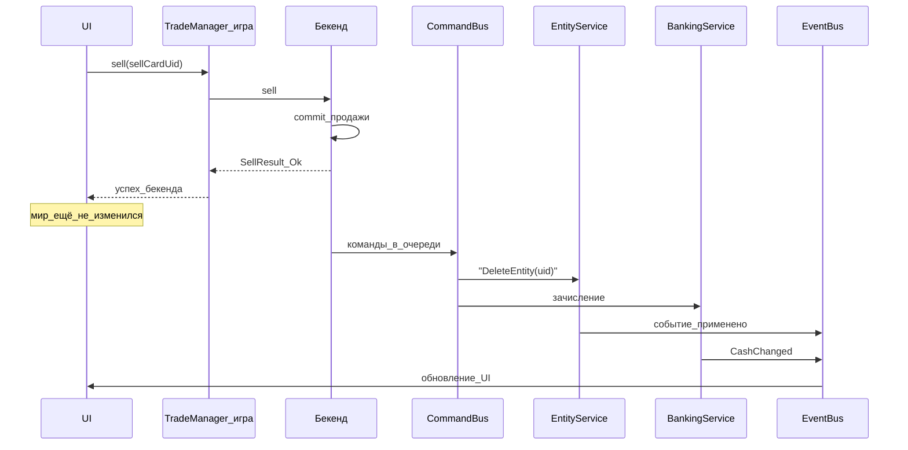

# Принцип применения изменений мира

Назад: [[Architecture.md]]

## Зачем это нужно

Игровой сервер и бекенд — разные слои системы.

- **Бекенд** хранит экономику, транзакции и решает итог операции: что продано, сколько зачислить, какие сущности больше не принадлежат игроку.
- **Игровой сервер** отображает мир: предметы в инвентаре, техника на карте, наличные у персонажа.

Если бы игровой сервер сам решал, что удалять и сколько начислять, экономику можно было бы обойти. Поэтому бекенд — **источник истины**.

При этом мир на игровом сервере обновляется **отдельным шагом** — через CommandBus. Так каждый сервис делает только своё: торговля не удаляет предметы, сервис сущностей не знает про корзины, банковский сервис не знает про SellCard.

## Главное правило

> **RPC фиксирует решение бекенда. CommandBus применяет это решение в игровом мире.**

Ответ метода на бекенде (например, [[TradeManager.SellMethods.md#sell]]) означает: «операция принята и зафиксирована на бекенде». Это **не** означает, что предметы уже исчезли из инвентаря или баланс уже изменился в игре.

## Два слоя состояния

После успешного `sell` (`SellResult.status = Ok`) состояние на бекенде и в игровом мире **различается**. Это ожидаемое поведение, а не ошибка.

| Слой | Что уже произошло |
|------|-------------------|
| Бекенд | продажа зафиксирована; сущности помечены как проданные; деньги зачислены |
| Игровой мир | предметы ещё на месте; локальный баланс ещё не обновлён |

Изменения в мире наступают позже — когда CommandBus получит и выполнит команды от бекенда.

## Поток продажи



1. UI вызывает продажу через TradeManager на игровом сервере.
2. TradeManager отправляет запрос на бекенд.
3. Бекенд проводит продажу, создаёт транзакцию, помечает сущности как проданные, зачисляет деньги — и возвращает `SellResult` с `status = Ok`.
4. В этот момент **игровой мир не меняется**.
5. Бекенд ставит в очередь команды для игрового сервера (удаление предметов, зачисление в локальный баланс).
6. CommandBus забирает команды, передаёт их профильным сервисам.
7. После успешного применения сервисы публикуют локальные события — UI, чат и другие подписчики реагируют.

## Роли сервисов

| Компонент | Что делает | Чего не делает |
|-----------|------------|----------------|
| TradeManager (игра) | RPC к бекенду: корзина, sell, инвентарь для UI | не удаляет предметы, не меняет баланс |
| Бекенд / TradeManager (бек) | проверки, транзакция, решение состава и суммы, постановка команд в очередь | не трогает игровые объекты напрямую |
| CommandBus | забирает команды, маршрутизирует, возвращает отчёт о выполнении | не содержит бизнес-логики торговли |
| EntityService / [[EntityManager.md\|EntityManager]] | spawn, remove, реестр сущностей; синк владения/контейнера/слота (игра → бекенд) | не знает про корзины и цены; не принимает character ops (HP/позиция) |
| BankingService / [[BankingManager.md\|BankingManager]] | наличные и счета в мире | не знает про SellCard |
| EventBus (локальный, на игровом сервере) | единая диспетчеризация: сигналы с бекенда и локальные факты после apply | не меняет мир сам; не шлёт на бекенд |
| GameBackendManager | принимает сигнал с бекенда и **публикует** его в EventBus | не вызывает UI/сервисы напрямую |

Подробнее о командах: [[../CommandBus/Commands.md]]. О CommandBus: [[../CommandBus/CommandBus.md]]. Правило EventBus: [[../Common concepts.md]].

## CommandBus и EventBus

Это **две разные задачи**.

### CommandBus — команды с бекенда

CommandBus получает от бекенда императивные команды: «удали предмет с таким uid», «заспавни сущность». Целевой сервис выполняет команду и возвращает отчёт через `CommandBus::reportCommands`: `Completed` или `Fail` (+ `FailReason`). После этого CommandBus отправляет отчёт на бекенд.

Воркер опрашивает бекенд каждые 0.5 секунды ([[../CommandBus/CommandBus.md]]).

Команда `DeleteEntity` ([[../CommandBus/Commands.md]]) всегда обрабатывается сервисом, отвечающим за сущности — тем же, что удаляет предметы при уничтожении или других сценариях. TradeManager в эту цепочку не входит.

### EventBus — локальные события на игровом сервере

Local EventBus — **единая точка диспетчеризации** уведомлений на игровом сервере.

**Правило:** все события с бекенда обязательно публикуются в EventBus; дальше только подписки — даже если слушатель один. Мост (`GameBackendManager`) не раздаёт сигналы напрямую в меню, CSM и т.п.

```text
бекенд → GameBackendManager → EventBus.publish → подписчики
```

В EventBus также попадают локальные факты после успешного apply команды или локального действия:

- чат: «продан AK-74 за 500»;
- UI магазина: обновить инвентарь и баланс;
- оповещения: показать сообщение игроку;
- CharacterStateManager: мягкая сверка `stateVersion` по `CharacterStateChanged`.

Подписчики сами решают реакцию; издатель не знает про конкретные меню ([[../Common concepts.md]]).

EventBus **не** отправляет события на бекенд и **не** заменяет CommandBus.

**CommandBus** доставляет команды и меняет мир. **EventBus** сообщает, что что-то произошло (сигнал с бекенда или мир уже изменился).

## Что видит игрок и UI

У операции продажи три понятных состояния:

1. **Запрос отправлен** — UI ждёт ответ от бекенда.
2. **Бекенд принял** (`SellResult.status = Ok`) — продажа зафиксирована на бекенде, но предмет может ещё быть в инвентаре, а баланс — прежним.
3. **Мир обновлён** — предмет исчез, деньги пришли. Это произошло после выполнения команд CommandBus.

Важно: **`Ok` не означает «всё уже произошло в игре»**. UI должен это учитывать — например, показывать состояние «обрабатывается», пока не придут команды и не обновится мир.

## Почему TradeManager не удаляет предметы сам

Альтернатива — сразу после успешного ответа бекенда TradeManager на игровом сервере сам удаляет предметы и зачисляет деньги. Такой подход мы **не используем**, потому что:

- **TradeManager начинает управлять миром** — это не его зона ответственности; он должен заниматься торговым контрактом с бекендом.
- **Дублируется логика удаления** — продажа, уничтожение предмета и админские операции должны идти через один сервис сущностей.
- **Расходится с покупкой** — при buy предмет или техника появляются через CommandBus, а не через TradeManager.

CommandBus — **единая точка входа** для мутаций мира с бекенда. Каждая команда делегируется профильному сервису.

## Симметрия с покупкой

Тот же принцип работает и для покупки ([[TradeManager.BuyMethods.md#buy]]):

- RPC `buy` фиксирует покупку на бекенде и возвращает результат.
- Предмет или техника **появляются в мире** через CommandBus: `SpawnEntity` ([[../CommandBus/Commands.md]]).

Продажа — тот же принцип в обратную сторону: бекенд принимает решение, CommandBus применяет его в мире.

## Связанные документы

- [[Architecture.md]] — оглавление архитектуры менеджеров
- [[TradeManager.SellMethods.md#sell]] — метод продажи на бекенде
- [[TradeManager.BuyMethods.md#buy]] — метод покупки на бекенде
- [[../CommandBus/CommandBus.md]] — доставка команд с бекенда
- [[../CommandBus/Commands.md]] — список команд
- [[EntityManager.md]] — регистрация и удаление сущностей
- [[BankingManager.md]] — денежные средства персонажа
- [[../ArchGame/ArchGame.md]] — сервисы и асинхронность на стороне игры
- [[../ArchGame/RpcServiceComponent.md]] — RPC-компоненты для UI
- [[../Common concepts.md]] — GameBackendManager и события

Детали обработки ошибок, идемпотентности и восстановления после сбоев — в отдельном документе (пока не описаны).
