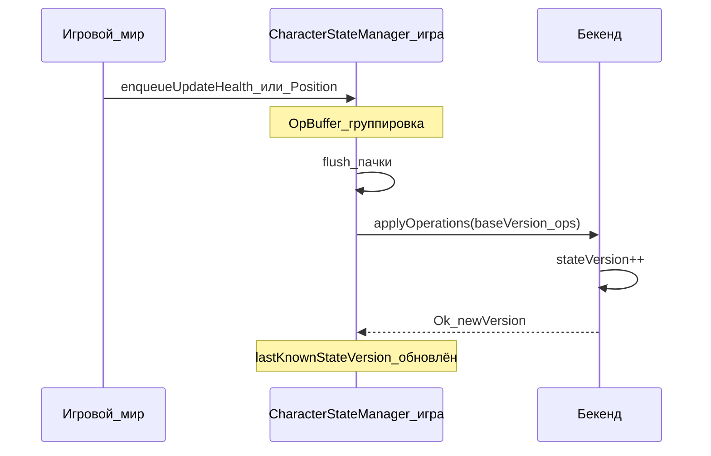
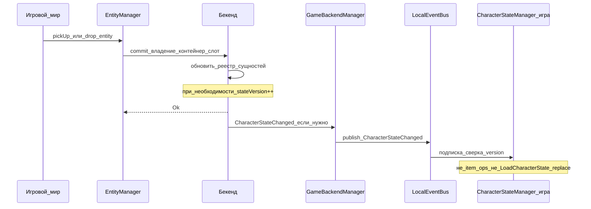
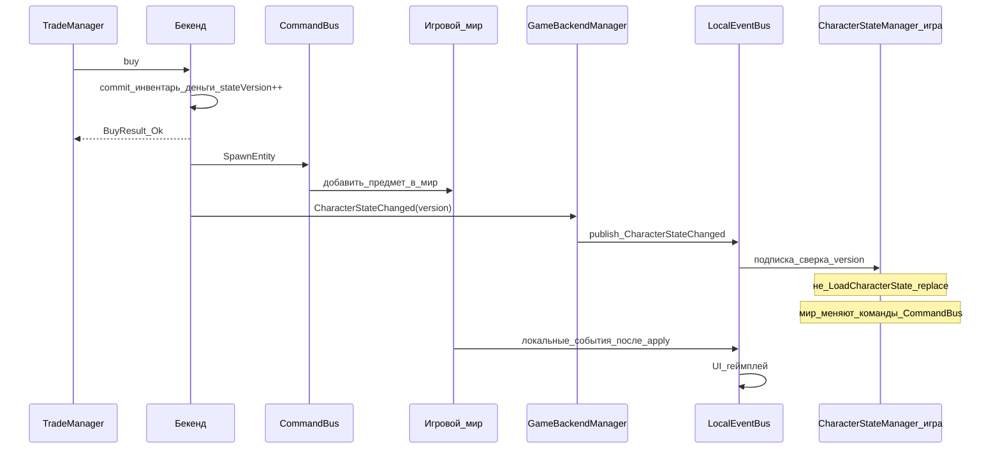

# CharacterStateManager

> **Статус:** на согласовании.

Назад: [[Architecture.md]]

Архитектура синхронизации состояния персонажа между **игровым сервером** и бекендом.

> В тексте «игра» / «игровой сервер» — сторона, которая хранит локальную копию состояния и общается с бекендом. Это не UI-клиент игрока как отдельный источник истины.

## Главные правила

1. **Единственный источник истины — бекенд.** Игровой сервер хранит локальную копию для геймплея; изменения должны подтверждаться бекендом.
2. **Основной канал синка игра → бекенд для состояния персонажа — операции (дельты) с `baseVersion`**, а не полная перезапись снимка.
3. **Основной канал мутаций бекенд → мир — CommandBus** ([[BackendGameMutation.md]]), а не `LoadCharacterState` после каждого события.
4. **Полный снимок** (`LoadCharacterState` / `getCharacterState`) — только регистрация, реконнект и recovery после конфликта версий.
5. Union / merge двух «текущих» списков инвентаря **запрещён**.
6. **Синхронизация предметов инвентаря / экипировки с бекендом — ответственность [[EntityManager.md|EntityManager]].** Предмет остаётся сущностью в мире; к инвентарю он привязан только контейнером и слотом. CSM **не** принимает и **не** шлёт item/equip operations.
7. **Публичный API CSM — по одной операции** (здоровье, витальность, позиция, наличные вне Trade). Группировку в пачку и момент вызова RPC (`applyOperations`) выполняет только CSM; вызывающий код пачки не собирает.

---

## Ответственность CharacterStateManager

CharacterStateManager:

- хранит проекцию / снимок состояния персонажа для синка;
- регистрирует персонажа при спавне / возрождении;
- принимает **одиночные** операции через узкие методы (`enqueueUpdateHealthOperation`, `enqueueUpdatePositionOperation`, …) — **без** item/equip;
- **внутри** группирует их в буфер, решает момент flush и вызывает RPC `applyOperations` на бекенд;
- ведёт `stateVersion` / `lastKnownStateVersion`;
- реагирует на сигнал с бекенда о внешней смене версии (мягкая сверка), **не** подменяя CommandBus.

Он **не содержит** бизнес-логики инвентаря, здоровья, экономики и торговли и **не синхронизирует** расположение сущностей. Инвентарь / мир вызывают [[EntityManager.md|EntityManager]]; здоровье / позиция / наличные (вне Trade) — методы CSM; команды CommandBus и локальные события — отдельные каналы.

| Зона | Кто отвечает |
|------|----------------|
| Реестр сущностей, владение, контейнер/слот, синк предметов с бекендом | [[EntityManager.md\|EntityManager]] |
| Наличные и счета | [[BankingManager.md\|BankingManager]] |
| Покупка / продажа | [[TradeManager.md\|TradeManager]] |
| Применение решений бекенда в мире | [[../CommandBus/CommandBus.md\|CommandBus]] |
| Локальные уведомления UI / геймплея | EventBus (локальный, на игровом сервере) |

В снимке CharacterState деньги и инвентарь — **проекции** для удобства игры и UI:

- деньги — из Banking;
- инвентарь / экипировка — из реестра EntityManager (по связям контейнер + слот / владение персонажем);
- источник истины по доменам остаётся у Banking / Entity / Trade.

---

## Хранимое состояние

### 1. Здоровье и витальность

- общее HP;
- состояние частей тела;
- уровень голода;
- уровень жажды.

### 2. Экономика (проекция)

- сумма наличных у персонажа («в кармане»).

### 3. Инвентарь и экипировка (проекция)

Снимок для UI / recovery может включать:

- куртка (контейнер);
- штаны (контейнер);
- рюкзак (контейнер);
- головной убор;
- первичное / вторичное оружие;
- пистолет;
- дополнительные слоты (гранаты, карта, ПНВ и т.п.).

Каждый предмет и контейнер — сущность со стабильным `entityUid` ([[EntityManager.md]]). Вложенность сохраняется (содержимое рюкзака уезжает вместе с рюкзаком).

**Важно:** это не отдельный «список инвентаря», которым владеет CSM. Это проекция связей из EntityManager. Подбор, дроп, перемещение, экипировка и передача синхронизируются **только** через EntityManager, не через `applyOperations` CSM.

### 4. Позиция

- координаты;
- положение тела: стоя / сидя / лёжа (и иные позы при необходимости).

### 5. Версия состояния

- `stateVersion: int` — монотонно растёт на бекенде после каждого успешного изменения состояния персонажа;
- игровой сервер хранит `lastKnownStateVersion` после последнего успешного ответа или снимка.

Изменение расположения сущностей у персонажа на бекенде (через EntityManager или Trade) **может** увеличивать `stateVersion` персонажа, если проекция инвентаря входит в CharacterState. Тогда публикуется `CharacterStateChanged`; CSM только мягко сверяет версию и **не** принимает item ops.

---

## Три канала синхронизации

| Канал | Направление | Семантика |
|--------|-------------|-----------|
| Методы CSM (`enqueueUpdateHealthOperation`, …) → RPC `applyOperations` | игра → бекенд | состояние персонажа (HP, витальность, позиция, cash вне Trade); снаружи — одна операция; на бекенд уходит пачка с `baseVersion`; обязателен ответ (Ok / Fail) |
| Методы EntityManager (подбор / дроп / move / equip / …) | игра → бекенд | владение и расположение сущностей; см. [[EntityManager.md]] |
| CommandBus | бекенд → игра | «обязан изменить мир»; обязателен отчёт о выполнении |
| Событие `CharacterStateChanged` + локальный EventBus | бекенд → мост → EventBus → подписчики; также локальные факты после apply | «случилось»; мир само событие не меняет |

Локальный EventBus — **не** двухнаправленный канал с бекендом (на бекенд не шлёт).

**Правило:** все события с бекенда публикуются в EventBus; диспетчеризация только через подписки — даже если слушатель один. Мост (`GameBackendManager`) не вызывает CSM/UI напрямую. См. [[../Common concepts.md]].

---

## Методы

### RegisterCharacter

```text
RegisterCharacter(...)
```

Вызывается при возрождении (спавне). На бекенде создаётся или активируется персонаж, формируется стартовое состояние и начальный `stateVersion`.

После успеха — `LoadCharacterState` (или снимок в ответе регистрации, если контракт его возвращает). Стартовые предметы в мире при необходимости ставятся через CommandBus (`SpawnEntity` и т.п.); реестр сущностей — EntityManager.

---

### LoadCharacterState / getCharacterState

```text
LoadCharacterState(characterUid) → CharacterState + stateVersion
```

Полный снимок: здоровье, наличные, **проекция** инвентаря/экипировки с вложенностью и `entityUid` (из реестра EntityManager), позиция, `stateVersion`.

**Используется только для:**

- после успешной регистрации;
- реконнекта / загрузки персонажа в мир;
- recovery после `VersionConflict` (когда локально нельзя надёжно догнать операциями);
- административной принудительной синхронизации.

**Не используется как** обработчик по умолчанию на каждое `CharacterStateChanged` во время активной игры.

---

### Публичный API операций (игра → CSM)

Системы здоровья, движения и т.п. **не** собирают `operations[]` и **не** вызывают HTTP/`applyOperations` напрямую. Они вызывают узкие методы CSM — **по одному элементу**.

Системы инвентаря / мира для предметов вызывают **EntityManager**, не CSM.

```text
enqueueUpdateHealthOperation(...)
enqueueUpdateThirstOperation(...)
enqueueUpdateHungerOperation(...)
enqueueUpdatePositionOperation(...)
enqueueCashPickedUpOperation(...)
enqueueCashDroppedOperation(...)
enqueueCashTransferredOperation(...)
// … по одному методу на тип из каталога операций CSM
```

Смысл вызова: поставить намерение в очередь синка. Это **не** мгновенный commit на бекенде и **не** мутация мира через CommandBus.

Опционально CSM может дать `flushPendingOperations()` — тоже без сборки пачки снаружи.

**Ответственность границ:**

| Кто | Делает | Не делает |
|-----|--------|-----------|
| Здоровье / движение / геймплей (не предметы) | вызывает `enqueueUpdateHealthOperation` и аналоги | не знает про `baseVersion`, пачку, debounce, RPC |
| Инвентарь / мир (предметы) | вызывает методы EntityManager | не вызывает item ops у CSM; не шлёт character `applyOperations` |
| CSM | буфер, группировка, `baseVersion`, flush, вызов `applyOperations` | не синхронизирует владение/расположение сущностей |
| EntityManager | синк inventory/equip/location с бекендом | не шлёт character ops (HP/позиция) в обход CSM |
| Banking / Trade | свои зоны | не шлют character ops в обход CSM |

Имена `enqueue*Operation` подчёркивают постановку в очередь (ещё не commit на бекенде). Итоговый RPC — `applyOperations` (см. ниже).

---

### applyOperations (RPC бекенда, внутренний для CSM)

```text
POST /character/operations

applyOperations(characterUid, baseVersion, operations[]) → ApplyOperationsResult
```

Это **транспортный** контракт игра → бекенд для **состояния персонажа**. Вызывается **только из CSM** при flush внутреннего буфера. Публичным API для систем мира не является. Item/equip operations в этот контракт **не входят**.

Пример тела:

```json
{
  "baseVersion": 125,
  "operations": [
    { "type": "UpdateHealth", "hp": 82, "bodyParts": { } },
    { "type": "UpdateHunger", "value": 40 },
    { "type": "UpdatePosition", "x": 1.0, "y": 2.0, "z": 3.0, "stance": "Stand" }
  ]
}
```

Все операции пачки применяются на бекенде **в одной транзакции**.

**Правила:**

1. Если `baseVersion !=` текущий `stateVersion` на бекенде → `Fail` / `VersionConflict` (без частичного применения).
2. При любой доменной ошибке — отказ **всей** пачки (политика по умолчанию).
3. При успехе `stateVersion` увеличивается (**+1 за успешную пачку** — рекомендуемая политика).
4. Наличные в ops согласуются с BankingManager. Владение/расположение предметов — **только** через EntityManager.

**Успех:**

```json
{
  "success": true,
  "newVersion": 126
}
```

При необходимости контракт может дополняться per-op деталями или кратким diff — но минимальный контракт: новый `stateVersion`.

**Конфликт:**

```json
{
  "success": false,
  "reason": "VersionConflict",
  "currentVersion": 126
}
```

---

## Внутренний буфер операций (внутри CSM)

Группировка и момент отправки — **внутренняя** ответственность CSM, не вызывающего кода.

```text
системы здоровья / движения / cash
  → enqueueUpdateHealthOperation / enqueueUpdatePositionOperation / …
  → OpBuffer (внутри CSM)
  → flush
  → applyOperations(baseVersion, ops[])
```

Пример: несколько подряд `enqueueUpdateHealthOperation` уходят одной HTTP-пачкой `UpdateHealth`.

Буфер сбрасывается (flush), если:

- прошло 100–200 мс;
- накопилось больше N операций;
- операция помечена как требующая немедленной отправки;
- явный `flushPendingOperations()`.

Пока пачка in-flight, новые вызовы публичных методов либо встают в следующий буфер, либо блокируются политикой UI/геймплея — главное, не слать параллельные пачки с одним и тем же `baseVersion` без явной очереди.

Отдельная внешняя «шина операций» (OperationBus), куда системы кладут ops, а кто-то снаружи выбирает RPC, **не нужна**: буфер и RPC живут в CSM; Entity / Trade / Banking ходят своими каналами.

---

## Каталог операций (игра → бекенд, CSM)

Идентификаторы предметов в проекции снимка — стабильные `entityUid`, но **операции над предметами сюда не входят**.

Тип в JSON-пачке (`UpdateHealth`, …) — контракт бекенда. На игровом сервере ему соответствует **публичный метод CSM** на один элемент.

### Здоровье и витальность

| Операция (бек) | Метод CSM | Смысл |
|----------------|-----------|--------|
| `UpdateHealth` | `enqueueUpdateHealthOperation` | HP / части тела |
| `UpdateThirst` | `enqueueUpdateThirstOperation` | жажда |
| `UpdateHunger` | `enqueueUpdateHungerOperation` | голод |

### Деньги (вне TradeManager)

| Операция (бек) | Метод CSM | Смысл |
|----------------|-----------|--------|
| `CashPickedUp` / `CashDropped` | `enqueueCashPickedUpOperation` / `enqueueCashDroppedOperation` | подобрал / выбросил наличные |
| `CashTransferred` | `enqueueCashTransferredOperation` | передал другому игроку |

### Позиция

| Операция (бек) | Метод CSM | Смысл |
|----------------|-----------|--------|
| `UpdatePosition` | `enqueueUpdatePositionOperation` | координаты + поза |

Позиция **не** шлётся на каждый тик. Throttle на игровом сервере:

- не чаще одного раза в **3 секунды**, и/или
- при смещении более X метров.

Для позиции допустимо ослабить строгость `baseVersion` (last-write-wins), чтобы движение не конфликтовало с пачками HP/витальности.

### Что не входит в character operations

| Действие | Куда |
|----------|------|
| Подбор / дроп / move / equip / unequip / transfer / split-merge стеков / destroy сущности | [[EntityManager.md\|EntityManager]] |
| `Buy` / `Sell` | [[TradeManager.md\|TradeManager]] на бекенде; мир — CommandBus |
| Админская выдача предметов | бекенд + CommandBus |
| Спавн техники / предметов в мире | CommandBus (`SpawnEntity`) |
| Открытие/закрытие контейнера (если влияет на реестр сущностей) | EntityManager (или отдельный контракт мира), не CSM |

---

## Два слоя и источники изменений

| Источник | Примеры | Кто фиксирует истину | Как доходит до второй стороны |
|----------|---------|----------------------|-------------------------------|
| Игровой мир (персонаж) | урон, жажда/голод, позиция, cash вне Trade | CSM → `applyOperations` | ответ + новый `stateVersion` |
| Игровой мир (предметы) | подбор, дроп, экипировка, move, transfer | EntityManager → бекенд | commit связей; при необходимости `CharacterStateChanged` / локальный EventBus |
| Бекенд | `buy`, `sell`, админская выдача | бекенд | **CommandBus** в мир + сигнал `CharacterStateChanged` |
| Recovery | спавн, реконнект, рассинхрон | `LoadCharacterState` (+ проекция из EntityManager) | игра применяет снимок как базу |

После успешного `buy` / `sell` слои временно расходятся — это ожидаемо ([[BackendGameMutation.md]]): бекенд уже зафиксировал сделку, мир обновится командами CommandBus.

---

## Почему не мержим два снимка

### Кейс A — только добавления (union случайно «работает»)

| | Состав |
|--|--------|
| Игра | АК, тушёнка, бронзовый слиток |
| Бекенд | АК, тушёнка, топор |
| Ожидание | АК, тушёнка, слиток, топор |

### Кейс B — дроп + параллельное добавление на бекенде (union ломается)

| | Состав |
|--|--------|
| Игра | АК, бронзовый слиток |
| Бекенд | АК, тушёнка, топор |
| Ошибочный union | АК, слиток, тушёнка, топор — **тушёнка вернулась** |
| Правильный итог | АК, бронзовый слиток, топор |

Правильный итог — операции от общего предка (item-ops через EntityManager):

```text
base (stateVersion = N):  АК, тушёнка
игра (EntityManager):     DropEntity(тушёнка), PickUpEntity(слиток)
бекенд:                   add(топор)  // покупка / выдача → CommandBus
итог (N+k):               АК, слиток, топор
```

Поэтому **запрещено** после `CharacterStateChanged` безусловно делать `LoadCharacterState` и затирать локальный инвентарь: параллельный дроп/подбор (уже ушедший или ещё in-flight в EntityManager) будет потерян или откатится.

---

## Потоки

### Операция из игры (здоровье / позиция)



### Подбор / дроп предмета (не CSM)



### Изменение с бекенда (покупка)



---

## Серверные события (бекенд → игра)

После изменения состояния персонажа на бекенде вне игровых операций CSM публикуется сигнал, например:

```json
{
  "characterUid": "...",
  "version": 126,
  "reason": "Buy"
}
```

Полное состояние через событие **не** передаётся. Тот же сигнал может прийти после commit’а связей EntityManager / Trade, если вырос `stateVersion` персонажа.

### Доставка и обработка на игровом сервере

```text
бекенд: CharacterStateChanged
  → GameBackendManager
  → EventBus.publish(CharacterStateChanged)
  → подписчики (в т.ч. CharacterStateManager, UI)

У CSM по подписке:
→ если version <= lastKnownStateVersion: ignore
→ мутации мира уже/параллельно идут через CommandBus
→ если есть pending / in-flight character operations:
      не делать full replace;
      дождаться ack либо перейти в сценарий VersionConflict / перебазирование
→ параллельные item-ops EntityManager CSM не отменяет и не мержит сам
→ если нет конфликтной очереди: обновить lastKnownStateVersion (мягкая сверка)
→ LoadCharacterState — только register / reconnect / recovery после конфликта
```

Локальные события после apply в мире (`HealthChanged`, `InventoryChanged`, `MoneyChanged`, …) профильные системы тоже публикуют **в тот же EventBus**. Подписчики сами решают реакцию ([[../Common concepts.md]]).

---

## VersionConflict и recovery

При `VersionConflict` на канале CSM (`applyOperations`):

1. Запросить `LoadCharacterState` **или** дождаться/дозапросить недостающие команды CommandBus.
2. Остановить / очистить / перебазировать внутренний OpBuffer CSM.
3. Привести мир к согласованной базе (снимок + уже применённые команды CommandBus), **не** через трёхсторонний merge двух текущих списков инвентаря.
4. Установить `lastKnownStateVersion` из снимка / согласованной версии.
5. Пересчитать локальную очередь character ops относительно нового base и при необходимости повторить `applyOperations`.
6. Рассинхрон предметов при recovery согласовывать с EntityManager (проекция инвентаря в снимке строится из его реестра); item-ops не переигрывать через CSM.

Полный снимок применяют, когда локальное состояние нельзя надёжно догнать операциями:

- первый спавн после `RegisterCharacter`;
- реконнект;
- исчерпаны повторы после `VersionConflict`;
- административная принудительная синхронизация.

**Правило apply snapshot**

1. Остановить/очистить неподтверждённые операции в OpBuffer CSM (или перебазировать после загрузки).
2. Привести мир к снимку бекенда (в т.ч. через известные `entityUid`; предметы — согласованно с EntityManager).
3. `lastKnownStateVersion = stateVersion` из снимка.
4. Только после этого снова принимать локальные вызовы `enqueueUpdate*Operation` / аналогов у CSM; item-поток — снова через EntityManager.

---

## Итоговая схема

```text
Игрок / игровой мир
        │
        ├── здоровье / позиция / cash ──► CharacterStateManager
        │                                      │ OpBuffer
        │                                      ▼
        │                               applyOperations
        │                                      │
        └── предметы (контейнер/слот) ──► EntityManager ──► бекенд (реестр сущностей)
                                                       │
                                                       ▼
                                                    Backend
                                                       │
                          Backend (buy/sell/выдача) ───┤
                                                       │
                                            ┌──────────┴──────────┐
                                            ▼                     ▼
                                      CommandBus          CharacterStateChanged
                                            │                     │
                                            ▼                     ▼
                                     мутация мира         GameBackendManager
                                            │                     │
                                            └──────────┬──────────┘
                                                       ▼
                                                Local EventBus
                                          ┌────────────┴────────────┐
                                          ▼                         ▼
                                   CSM сверка version          UI / геймплей
                                (не blind reload, не item ops)

Recovery (register / reconnect / VersionConflict):
  LoadCharacterState → база мира + lastKnownStateVersion
  (инвентарь в снимке = проекция EntityManager)
```

---

## Взаимодействие с другими сервисами

| Сервис | Роль |
|--------|------|
| [[EntityManager.md]] | реестр, владение, контейнеры/слоты; **синк предметов с бекендом**; подбор/дроп/move/equip — его API, не CSM |
| [[BankingManager.md]] | наличные и счета; CSM отражает cash в снимке и может слать cash ops вне Trade |
| [[TradeManager.md]] | buy/sell; не через `applyOperations` CSM и не через item-методы CSM |
| [[../CommandBus/CommandBus.md\|CommandBus]] | `SpawnEntity` |
| Local EventBus | единая диспетчеризация: сигналы с бекенда и локальные факты после apply |
| GameBackendManager | мост: сигнал с бекенда → **только** `EventBus.publish`; character ops RPC — из CSM; entity location RPC — из EntityManager |

---

## Анти-паттерны

1. Отправка полного инвентаря как «истины игры» без версионирования / ops EntityManager.
2. Union / merge двух текущих списков инвентаря.
3. После buy/sell сразу `LoadCharacterState` и перезапись мира — конфликтует с параллельным дропом/подбором.
4. TradeManager (или CSM) сам меняет мир в обход CommandBus.
5. `BuyItem` / `SellItem` в каталоге character operations.
6. Item/equip operations (`PickUpEntity`, `DropEntity`, `MoveEntity`, `EquipItem`, …) в CSM / `applyOperations` — синк предметов только через EntityManager.
7. Двухнаправленный EventBus как замена `applyOperations`, EntityManager и CommandBus (событие не даёт обязательного ack и чёткого apply).
8. Прямая раздача с `GameBackendManager` на CSM/UI в обход EventBus.
9. Вызывающий код собирает `operations[]` или сам вызывает `applyOperations` — пачка и RPC только внутри CSM.
10. Внешний OperationBus / общая шина, которая маршрутизирует и character ops, и Entity/Trade/Banking RPC.

---

## Преимущества модели

- бекенд — единственный источник истины;
- предметы остаются сущностями мира; синк владения/слотов — в одном месте (EntityManager);
- CSM не дублирует реестр сущностей и не смешивает HP/позицию с item-ops;
- нет merge полного состояния при обычном синке;
- публичный API CSM — по одной операции: системы персонажа не думают про батчинг и HTTP;
- внутренний OpBuffer снижает число HTTP-запросов для character ops;
- операции на бекенде атомарны в рамках пачки CSM;
- внешние изменения (торговля, выдача) применяются точно через CommandBus;
- полный снимок остаётся надёжным путём recovery, а не горячим путём каждого события;
- новые типы character ops добавляются методом CSM + записью в каталог без смены схемы каналов.

---

## Связанные документы

- [[Architecture.md]] — оглавление
- [[BackendGameMutation.md]] — бекенд фиксирует решение, CommandBus применяет в мире
- [[EntityManager.md]] — реестр сущностей и синк расположения / инвентаря
- [[BankingManager.md]] — наличные и счета
- [[TradeManager.md]] — покупка и продажа
- [[../CommandBus/CommandBus.md]] — доставка команд
- [[../CommandBus/Commands.md]] — каталог команд в мир
- [[../Common concepts.md]] — GameBackendManager и события
- [[CharacterStateManager (черновик) 1.md]] — предыдущая проработка
- [[CharacterStateManager (черновик) 2.md]] — исходный вариант с event → LoadCharacterState (отклонён как горячий путь)
