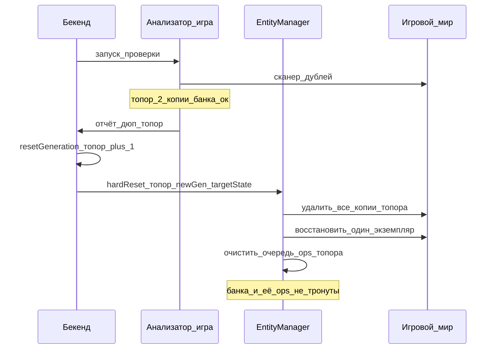
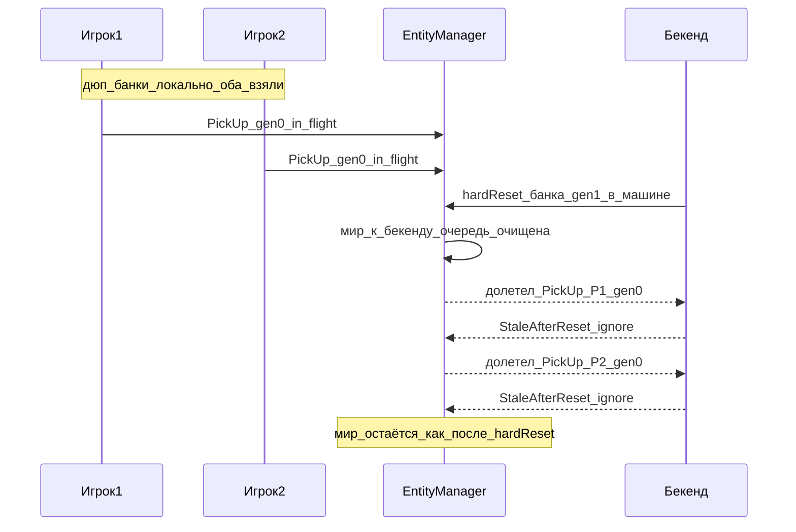

# Анализатор дюпов сущностей

Назад: [[EntityManager.md]] · [[Architecture.md]]

Документ описывает логику обнаружения дублей одной сущности в игровом мире, **hard-reset** к состоянию бекенда и отсечение устаревших операций через поколение `resetGeneration`.

## Зачем это нужно

В норме у одного `entityUid` в игровом мире существует **не больше одного** экземпляра объекта. Из‑за гонок внутреннего RPC, обхода локальных блокировок или эксплойта возможна ситуация: один и тот же `uid` одновременно «есть» у двух игроков (или в двух местах).

Бекенд остаётся источником истины: у сущности одно владение / один контейнер / одна позиция. Анализатор приводит мир к этой истине и не даёт долетевшим старым операциям снова разъехать состояние.

Анализатор — **страховка**. Основная защита от дюпа:

- один объект на `uid` (перенос, не клон);
- [[EntityLockRegistry.md|EntityLockRegistry]] на время синка и продажи;
- на бекенде второй `PickUp` / `Move` той же сущности → Fail.

---

## Кто запускает

Запуск инициирует **бекенд** (команда игровому серверу / периодический цикл с стороны бекенда).

Бекенд:

- знает, по каким `entityUid` нужен hard-reset;
- поднимает у этих сущностей `resetGeneration`;
- передаёт игре список затронутых `uid` и новые значения поколения (или игра узнаёт их из команды сверки).

Игровой сервер **не** решает сам «кого наказать» эвристикой без бекенда.

---

## `resetGeneration` — поколение на сущность

У **каждой** сущности свой счётчик поколения hard-reset (на бекенде и в реестре EntityManager на игровом сервере).

```text
банка  → resetGeneration = 0
топор  → resetGeneration = 4
пила   → resetGeneration = 0
```

Правила:

1. При создании сущности `resetGeneration = 0` (или иное стартовое значение по контракту).
2. Hard-reset по конкретному `uid` → **только у этой** сущности `resetGeneration += 1`.
3. Другие сущности не затрагиваются: дюп топора не меняет поколение банки и не отменяет операции по банке.
4. Глобальный счётчик hard-reset на весь мир / весь EntityManager — **запрещён**.

---

## Алгоритм анализатора

### 1. Обнаружение дубля

На игровом сервере для проверяемых `uid` (или по полному скану реестра мира):

```text
если число экземпляров с одним entityUid > 1 → кандидат на hard-reset
```

### 2. Решение на бекенде

Для каждого кандидата бекенд фиксирует истину: где сущность должна быть (владелец, контейнер, координаты в мире, либо «сущности больше нет»).

Затем:

```text
resetGeneration(uid) += 1
отправить игре команду hard-reset(uid, newGeneration, targetState)
```

Если у банки дублей нет, а у топора есть — hard-reset и `+1` поколения **только у топора**.

### 3. Hard-reset на игровом сервере

Для каждого `uid` из команды:

1. Удалить **все** локальные экземпляры с этим `uid` (обе «руки» при дюпе у двух игроков и т.п.).
2. Привести мир к `targetState` с бекенда:
   - если сущность должна существовать → заспавнить / восстановить **ровно один** экземпляр в нужном месте (машина, инвентарь, земля…);
   - если на бекенде сущности нет → ничего не создавать.
3. Установить локально `resetGeneration(uid) = newGeneration`.
4. Удалить из локальной очереди EntityManager **все** ещё не отправленные операции, связанные с этим `uid`.
5. Снять локальные блокировки реестра по этому `uid` (если были).

Политика «удалить обе копии и восстановить одну с бекенда» намеренно простая: не угадываем, чей экземпляр «правильный»; истина только на бекенде.

### 4. После hard-reset

Мир по этому `uid` совпадает с бекендом. Новые операции игроков допускаются уже с **новым** `resetGeneration`.

---

## Операции и игнор после hard-reset

### Поле в операции

Каждая операция расположения игра → бекенд по сущности несёт поколение, известное отправителю в момент отправки:

```text
{
  "entityUid": "...",
  "type": "PickUpEntity",
  "...": "...",
  "resetGeneration": 3
}
```

Поле обязательно для единого контракта; у сущностей без hard-reset обычно `0` (или актуальное значение из реестра).

### Правило на бекенде

```text
если op.resetGeneration < текущий resetGeneration сущности на бекенде
  → игнорировать / Fail (StaleAfterReset)
  → состояние сущности не менять
иначе
  → обычная доменная обработка
```

Эквивалентная жёсткая форма: принимать только `op.resetGeneration == текущий`.

### Правило на игровом сервере

После hard-reset:

- ответы на операции, отправленные со **старым** поколением, **не двигают мир** (ожидаем Fail / игнор, либо явно отбрасываем устаревший callback);
- в локальную очередь после reset не оставляем ops по этому `uid` со старым поколением;
- новые действия подписываются уже новым `resetGeneration`.

Так отсекается окно: дюп → hard-reset к «банке в машине» → долетают старые `PickUp` игрока 1 и игрока 2 → без поколения они снова разъехали бы бекенд и мир; с поколением они отвергаются.

---

## Потоки

### Hard-reset при дюпе топора (банка не затронута)



### Устаревший PickUp после hard-reset



---

## Связь с блокировками и CommandBus

| Механизм | Роль |
|----------|------|
| [[EntityLockRegistry.md\|EntityLockRegistry]] | не дать второму игроку / Trade стартовать dispose, пока uid занят |
| Анализатор + hard-reset | починить уже возникший дюп по команде бекенда |
| `resetGeneration` | отсечь операции из окна до hard-reset |
| CommandBus (`DeleteEntity` и т.п.) | обычные мутации бекенд → мир (продажа, админ); не путать с анализатором |

Команда `DeleteEntity` с бекенда по-прежнему выполняется даже для локально заблокированной сущности; hard-reset анализатора — отдельный сценарий сверки дублей.

Рекомендация: если по `uid` ещё есть активный in-flight и дюп не критичен, бекенд может отложить hard-reset до следующего цикла. Если hard-reset всё же выполнен — поколение и игнор старых ops обязательны.

---

## Анти-паттерны

1. Глобальный `resetGeneration` на весь сервер / весь EntityManager.
2. Hard-reset без восстановления одной копии с бекенда (удалили обе — предмет пропал из мира, на бекенде остался).
3. Выбор «чью копию оставить» по локальному времени / номеру игрока без запроса к бекенду.
4. Применить к миру Ok/Fail операции со старым `resetGeneration` после hard-reset.
5. Поднимать поколение у сущностей, у которых дублей не было.
6. Считать анализатор заменой локальному lock и проверке владения на бекенде.

---

## Краткий чеклист

- [ ] У сущности есть `resetGeneration` (бек + игра)
- [ ] Операция расположения несёт `resetGeneration`
- [ ] Бекенд режет ops с устаревшим поколением
- [ ] Запуск анализатора — с бекенда
- [ ] Hard-reset: удалить все локальные копии → восстановить одну по бекенду (или ноль)
- [ ] После hard-reset: очистить локальную очередь ops по этому `uid`
- [ ] Поколение `+1` только у затронутых `uid`

---

## Связанные документы

- [[EntityManager.md]] — реестр сущностей и синк расположения
- [[EntityLockRegistry.md]] — общий реестр блокировок
- [[EntityManager.Operations.md]] — операции и очередь (профилактика дюпа до анализатора)
- [[BackendGameMutation.md]] — бекенд фиксирует решение, мир меняется командами
- [[../CommandBus/CommandBus.md]] — доставка команд бекенд → игра
- [[CharacterStateManager (черновик) 3.md]] — не владеет деревом предметов; дюпы сущностей не его зона
