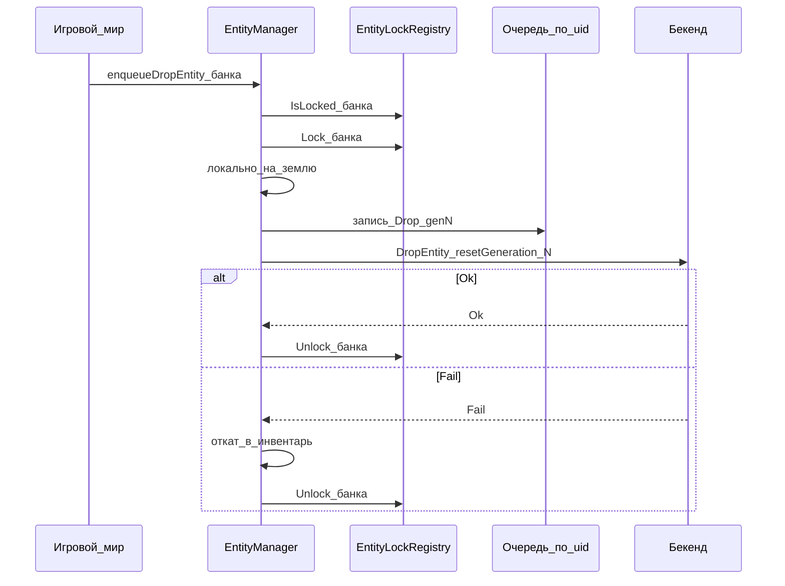

# Операции EntityManager (игра → бекенд)

Назад: [[EntityManager.md]] · [[Architecture.md]]

Логика обработки операций расположения сущностей: публичный API, локальное применение, блокировки через [[EntityLockRegistry.md|EntityLockRegistry]], очередь на сущность, отправка на бекенд и реакция на ответ. Дюпы и hard-reset — отдельно: [[EntityManager.DupeAnalyzer.md]].

## Главные правила

1. **Точка входа** — EntityManager (`enqueuePickupEntity`, `enqueueDropEntity`, `enqueueMoveEntity`, …). Инвентарь / мир / UI не ходят на бекенд напрямую и не через CharacterStateManager.
2. **Один `entityUid` — один экземпляр** в мире (перенос объекта, не клон при RPC).
3. Пока операция по сущности не подтверждена бекендом, uid в **EntityLockRegistry**; повторный dispose локально запрещён или ставится в очередь. Trade на время sell тоже пишет в этот же реестр (`SellPending`).
4. Блокировка — **по сущности** (и узко по родителю-контейнеру), не глобальная очередь на весь мир.
5. Бекенд — источник истины; отказ → откат локального оптимизма. Мутации с бекенда в мир — через CommandBus ([[BackendGameMutation.md]]), не из Trade напрямую.
6. Каждая операция несёт `resetGeneration` сущности ([[EntityManager.DupeAnalyzer.md]]).

---

## Публичный API

Системы мира вызывают `enqueue*` — **одна операция, постановка в очередь + запись в реестр блокировок**:

```text
enqueuePickupEntity(entityUid, targetContainerUid, characterUid, slot?)
enqueueDropEntity(entityUid, position, characterUid)
enqueueMoveEntity(entityUid, targetContainerUid, characterUid, slot?)
// далее по тому же шаблону:
// enqueueEquipItem / enqueueTransferEntity / …
```

Сигнатуры и шаги — в [[EntityManager.md#enqueuedropentity|EntityManager.md]] (методы). Снаружи не собирают пачки и не знают про HTTP. In-flight — очередь EntityManager; lock — [[EntityLockRegistry.md|EntityLockRegistry]].

Trade перед `sell` вызывает EntityLockRegistry (`IsLocked` / `Lock` с `SellPending`), не приватный API EntityManager. См. [[EntityLockRegistry.md]].

---

## Жизненный цикл одной операции

```text
1. Вызов enqueueDropEntity / enqueuePickupEntity / enqueueMoveEntity / …
2. Проверки: сущность есть, IsLocked не конфликтует, доменные правила игры
3. Lock затронутых uid (+ родитель по политике ContainerDispose)
4. Локально применить оптимизм в реестре / мире
   (перенос объекта, не клон)
5. Поставить операцию в исходящую очередь (с resetGeneration)
6. Отправить на бекенд (сразу или после debounce — политика EntityManager)
7. Ответ:
   Ok  → Unlock, зафиксировать связи, событие в Local EventBus
   Fail → откат локального оптимизма, Unlock, событие / сигнал UI
8. Снять из очереди; при необходимости отправить следующую ops по этому uid
```



---

## Очередь по сущности

Пока по `entityUid` есть **in-flight** запрос на бекенд:

- новые операции **по этому же uid** не уходят параллельно;
- они либо отклоняются локально, либо складываются в локальную очередь этого uid и отправляются после ответа (строго по одной / по согласованной пачке).

Операции по **другим** uid не ждут эту банку (нет глобальной блокировки мира).

Рекомендуемая гранулярность отправки: **по сущности** (или небольшая пачка независимых uid), не одна атомарная пачка «банка + топор + пила» на всех — иначе удаление банки админом роняет всю пачку.

---

## Родительский контейнер

| Ситуация | Политика |
|----------|----------|
| Положить банку в рюкзак | lock банки; рюкзак — как минимум `ContainerDispose` (нельзя выбросить/передать рюкзак) |
| Положить банку в машину | lock банки; машину **не** блокировать для вождения |
| In-flight по содержимому, затем dispose контейнера | dispose контейнера в очередь **после** завершения ops содержимого, либо отказ локально |

---

## Продажа и передача

### Передача / дроп / подбор

При старте — `EntityLockRegistry.Lock` + оптимизм (изъятие / перенос). Пока lock есть, второй игрок не поднимает; Trade видит `IsLocked` и не стартует sell.

### Продажа (Trade)

1. Trade → EntityLockRegistry: `IsLocked(uid)`? если да — sell не слать.  
2. Если нет — `Lock(uid, SellPending, InventoryOps, TradeManager)` (игрок не сможет `enqueueDropEntity`).  
3. Успех sell на бекенде → удаление в мире через CommandBus `removeEntity` ([[BackendGameMutation.md]]), не через «Trade сам удалил».  
4. `removeEntity` идемпотентен и выполняется **даже при lock**; после remove — `Unlock` и отмена pending ops EntityManager по uid.  

Подробный сценарий: [[EntityLockRegistry.md#сценарий-продажа]].

---

## Ответ бекенда и CommandBus

| Событие | Действие EntityManager |
|---------|-------------------------|
| Ok операции расположения | Unlock, мир уже совпал (или дотянуть мелочи), EventBus |
| Fail | откат оптимизма, Unlock |
| Fail / StaleAfterReset ([[EntityManager.DupeAnalyzer.md]]) | не двигать мир по этой ops; мир уже/будет выровнен hard-reset или сверкой |
| CommandBus `removeEntity` | удалить экземпляр где угодно (инвентарь / земля / «у другого»), Unlock, очистить очередь ops по uid |
| CommandBus выдача / спавн | создать/переместить по команде |

EntityManager **не** ждёт второй вызов CharacterStateManager для удаления предмета. CharacterStateManager при необходимости обновляет проекцию/версию по событию или `CharacterStateChanged`.

---

## Поля операции на бекенд (минимум)

```text
entityUid
type                    // PickUpEntity | DropEntity | MoveEntity | …
resetGeneration         // поколение сущности на момент отправки
payload                 // containerUid, slot, position, toCharacterUid, …
```

Бекенд проверяет владение / существование / контейнер. Второй одновременный успешный take одной банки на бекенде не допускается (второй → Fail).

---

## Кейсы

### Кейс A — дроп и подбор вторым игроком

1. Игрок 1 дропает банку → lock → на земле.  
2. Игрок 2 пытается поднять → видит lock / отказ, пока нет Ok дропа.  
3. Ok дропа → Unlock → игрок 2 может поднять (свой lock на время своего PickUp).

### Кейс B — передача и продажа

1. Игрок 1 передаёт → lock.  
2. Продажа локально запрещена.  
3. Без lock продажа могла бы пройти на бекенде, пока transfer не commit → затем `removeEntity` забрал бы банку и у игрока 2. Lock это предотвращает.

### Кейс C — админ удалил банку, в очереди ещё take топора и пилы

1. Команда `removeEntity(банка)` → банка исчезает, Unlock банки, ops по банке отменяются.  
2. Операции топора и пилы (другие uid) обрабатываются отдельно → Ok/Fail сами по себе.

### Кейс D — банка в рюкзак, затем выброс рюкзака

Пока банка in-flight, выброс рюкзака локально запрещён (`ContainerDispose`) или стоит в очереди после ответа по банке.

---

## Граница с CharacterStateManager

| EntityManager | CharacterStateManager | EntityLockRegistry |
|---------------|------------------------|-------------------|
| содержимое контейнеров, связи uid, позиция в мире | id надетых контейнеров, HP / витальность / поза | lock uid для EntityManager и Trade |
| отправка item operations | не шлёт item operations | не хранит расположение предметов |

---

## Анти-паттерны

1. Глобальная блокировка всех операций мира из‑за одной банки.  
2. Полный lock машины (нельзя ехать), когда банка кладётся в инвентарь техники.  
3. Клонирование объекта при «подборе» через RPC (два экземпляра одного uid).  
4. Sell без `EntityLockRegistry.Lock(SellPending)` — игрок успевает выбросить предмет.  
5. Отдельные lock внутри Trade и EntityManager вместо общего сервиса.  
6. Отказ выполнить CommandBus `removeEntity` из‑за lock.  
7. Атомарная пачка из многих uid как единственный способ отправки (хрупко при админ-delete одного предмета).  
8. Дублировать дерево содержимого рюкзака в CharacterStateManager.

---

## Связанные документы

- [[EntityManager.md]] — реестр и обзор
- [[EntityLockRegistry.md]] — общий сервис блокировок
- [[EntityManager.DupeAnalyzer.md]] — дюпы, hard-reset, `resetGeneration`
- [[TradeManager.md]] — sell и SellPending
- [[BackendGameMutation.md]] — бекенд → CommandBus → мир
- [[CharacterStateManager (черновик) 3.md]] — состояние персонажа без дерева лута
- [[../CommandBus/CommandBus.md]] — доставка команд
- [[../CommandBus/Commands.md]] — каталог команд
