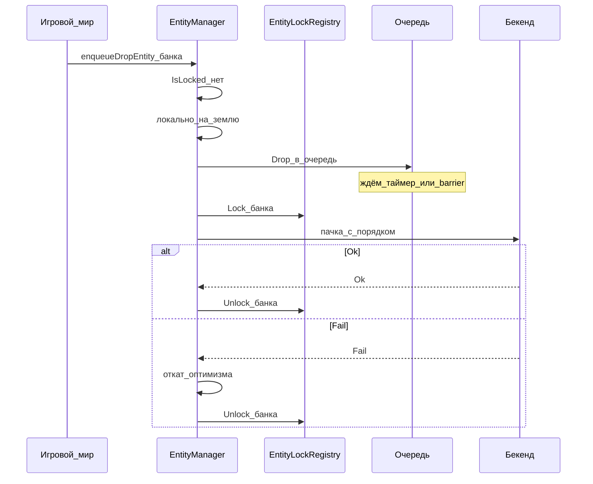

# Операции EntityManager (игра → бекенд)

Назад: [[EntityManager.md]] · [[Architecture.md]]

Логика обработки операций расположения сущностей: публичный API, локальное применение, исходящая очередь, flush (таймер / barrier), блокировки через [[EntityLockRegistry.md|EntityLockRegistry]] на время in-flight, реакция на ответ бекенда. Дюпы и hard-reset — отдельно: [[EntityManager.DupeAnalyzer.md]].

## Главные правила

1. **Точка входа** — EntityManager (`enqueuePickupEntity`, `enqueueDropEntity`, `enqueueMoveEntity`, …). Инвентарь / мир / UI не ходят на бекенд напрямую и не через CharacterStateManager.
2. **Один `entityUid` — один экземпляр** в мире (перенос объекта, не клон при RPC).
3. Ops складываются в **исходящую очередь**; на бекенд уходят **пачкой** по таймеру (~1 с) или по **barrier**.
4. В пачке ops **обязательно сохраняют порядок** (особенно цепочка по одному uid).
5. **Lock** в EntityLockRegistry — только пока по uid есть **in-flight** (пачка ушла, ответа ещё нет). Пока ops лишь в очереди — uid не locked: новые игровые ops по нему можно ставить в очередь (в т.ч. подбор вторым игроком после чужого дропа).
6. Блокировка — **по сущности** (и узко по родителю-контейнеру на время in-flight), не глобальная очередь на весь мир.
7. Бекенд — источник истины; отказ → откат локального оптимизма. Мутации с бекенда в мир — через CommandBus ([[BackendGameMutation.md]]), не из Trade напрямую.
8. Каждая операция несёт `resetGeneration` сущности ([[EntityManager.DupeAnalyzer.md]]).
9. Trade на время sell пишет в тот же реестр (`SellPending`) — это отдельный lock продажи, не очередь EM.

---

## Модель очереди и отправки (итог)

```text
enqueue* → проверки → локальный оптимизм → запись в очередь (без Lock)
         → flush: ~1 с  ИЛИ  barrier
         → Lock затронутых uid → пачка на бекенд (порядок сохранён) → in-flight
         → Ok / Fail → Unlock → при необходимости следующая пачка по uid
```

| Фаза | Поведение по uid |
|------|------------------|
| В очереди, ещё не ушло | оптимизм уже в мире сервера; lock нет; новые ops (в т.ч. другого игрока) дописываются в очередь **в порядке поступления** |
| Пачка ушла, ждём ответ (in-flight) | `EntityLockRegistry.Lock` — нельзя drop / pick / move / sell этого uid |
| Ok | `Unlock`, мир совпал (или дотянуть мелочи), EventBus |
| Fail | откат оптимизма по затронутым ops, `Unlock` |

### Когда flush

| Триггер | Что уходит |
|---------|------------|
| Таймер ~1 с | накопленные pending ops (по политике EM — все готовые uid или с лимитом размера пачки) |
| Barrier | принудительный flush и ожидание settled для нужного набора uid |

Примеры barrier:

- игрок открыл магазин → все предметы **его инвентаря** не должны быть in-flight (и pending по ним нужно сбросить и дождаться ответа), прежде чем `getInventoryForSell` / UI;
- старт `sell` / иные точки, где снимок инвентаря должен совпасть с бекендом.

Barrier **скоупается** по смыслу события: открытие магазина игроком 2 не обязано flush’ить дроп топора игрока 1, если топор не в инвентаре игрока 2.

### Пачка и группировка по uid

- **Одна сетевая пачка ≠ один uid.** В одном flush могут уйти ops по нескольким uid.
- **Сериализация и lock — по uid:** пока uid in-flight, параллельной отправки по нему нет; порядок ops одного uid в пачке и на бекенде сохраняется.
- На бекенде пачка **не** обязана быть одной атомарной транзакцией на все uid («банка + топор + пила»). Успех / отказ — **по uid** (или по отдельным ops); админ-`removeEntity` одной банки не должен ронять остальные uid пачки.

---

## Публичный API

Системы мира вызывают `enqueue*` — **одна операция, локальный оптимизм + постановка в очередь**. Снаружи не собирают пачки и не знают про HTTP.

```text
enqueuePickupEntity(entityUid, targetContainerUid, characterUid, slot?)
enqueueDropEntity(entityUid, position, characterUid)
enqueueMoveEntity(entityUid, targetContainerUid, characterUid, slot?)
// далее по тому же шаблону:
// enqueueEquipItem / enqueueTransferEntity / …
```

Сигнатуры и шаги — в [[EntityManager.md#enqueuedropentity|EntityManager.md]] (методы). In-flight и момент `Lock`/`Unlock` — этот документ и [[EntityLockRegistry.md|EntityLockRegistry]].

Trade перед `sell`: при необходимости barrier/flush по uid; затем `IsLocked` / `Lock` с `SellPending`. См. [[EntityLockRegistry.md]].

Опционально EM может дать явный `flushPendingOperations(characterUid?)` / `ensureSettled(entityUids|characterUid)` для barrier из UI / Trade — без сборки пачки снаружи.

---

## Жизненный цикл одной операции

```text
1. Вызов enqueueDropEntity / enqueuePickupEntity / enqueueMoveEntity / …
2. Проверки: сущность есть; если uid уже in-flight (IsLocked от EM) — отказ
   (не ставить новые игровые ops, пока летит пачка); доменные правила игры
3. Локально применить оптимизм в реестре / мире (перенос объекта, не клон)
4. Поставить операцию в исходящую очередь (с resetGeneration) — без Lock
5. Flush (таймер ~1 с или barrier):
   Lock затронутых uid (+ родитель ContainerDispose по политике)
   отправить пачку на бекенд с сохранением порядка
6. Ответ по uid / ops:
   Ok  → Unlock, зафиксировать связи, событие в Local EventBus
   Fail → откат локального оптимизма, Unlock, событие / сигнал UI
7. Снять из in-flight; при наличии хвоста очереди — следующий flush по правилам
```



---

## Очередь и in-flight

Пока ops по `entityUid` **только в очереди** (ещё не ушли):

- второй игрок **может** подобрать предмет, если локальный мир сервера уже показывает его на земле после оптимизма дропа;
- обе ops попадают в одну упорядоченную очередь uid: `[Drop P1, PickUp P2]` и могут уйти в одной пачке.

Пока по `entityUid` есть **in-flight** (пачка ушла, ответа нет):

- игровые операции с этим uid **блокируются** (`IsLocked`) — нельзя drop / pick / move / sell;
- параллельного второго запроса на бекенд по этому uid нет;
- новые попытки — отказ, пока нет Unlock.

Операции по **другим** uid не ждут эту банку (нет глобальной блокировки мира), кроме общего тика flush / своего barrier.

---

## Родительский контейнер

| Ситуация | Политика |
|----------|----------|
| Положить банку в рюкзак | на время in-flight банки — lock банки; рюкзак — как минимум `ContainerDispose` |
| Положить банку в машину | lock банки на in-flight; машину **не** блокировать для вождения |
| In-flight по содержимому, затем dispose контейнера | dispose контейнера нельзя, пока содержимое in-flight; либо в очередь после Unlock |

---

## Продажа и передача

### Передача / дроп / подбор

`enqueue*` → оптимизм + очередь. `Lock` — при уходе пачки в in-flight. Trade / другие игроки видят `IsLocked` только в этом окне (и при `SellPending`).

### Продажа (Trade)

1. При необходимости barrier: flush + дождаться, пока продаваемые uid не in-flight.  
2. Trade → EntityLockRegistry: `IsLocked(uid)`? если да — sell не слать.  
3. Если нет — `Lock(uid, SellPending, InventoryOps, TradeManager)` (игрок не сможет `enqueueDropEntity`).  
4. Успех sell на бекенде → удаление в мире через CommandBus `removeEntity` ([[BackendGameMutation.md]]).  
5. `removeEntity` идемпотентен и выполняется **даже при lock**; после remove — `Unlock` и отмена pending ops EntityManager по uid.  

Подробный сценарий: [[EntityLockRegistry.md#сценарий-продажа]].

---

## Ответ бекенда и CommandBus

| Событие | Действие EntityManager |
|---------|-------------------------|
| Ok операции расположения | Unlock, мир уже совпал (или дотянуть мелочи), EventBus |
| Fail | откат оптимизма, Unlock |
| Fail / StaleAfterReset ([[EntityManager.DupeAnalyzer.md]]) | не двигать мир по этой ops; мир уже/будет выровнен hard-reset или сверкой |
| CommandBus `removeEntity` | удалить экземпляр где угодно (инвентарь / земля / «у другого»), Unlock, очистить очередь ops по uid |
| CommandBus выдача / спавн | создать/переместить по команде |

EntityManager **не** ждёт второй вызов CharacterStateManager для удаления предмета. CharacterStateManager при необходимости обновляет проекцию/версию по событию или `CharacterStateChanged`.

---

## Поля операции на бекенд (минимум)

```text
entityUid
type                    // PickUpEntity | DropEntity | MoveEntity | …
resetGeneration         // поколение сущности на момент отправки
payload                 // containerUid, slot, position, toCharacterUid, …
```

Бекенд применяет ops **с сохранением порядка** в рамках uid. Второй одновременный успешный take одной банки на бекенде не допускается (второй → Fail) — на игровом сервере это закрывается очередью + lock на in-flight.

---

## Кейсы

### Кейс A — дроп и подбор вторым игроком (одна пачка)

1. Игрок 1 дропает банку → оптимизм на земле, `Drop` в очереди (lock ещё нет).  
2. Игрок 2 подбирает банку → оптимизм в инвентаре P2, очередь uid: `[Drop P1, PickUp P2]`.  
3. Flush (таймер или barrier) → `Lock(банка)` → пачка в том же порядке → ответ → `Unlock`.  
4. Рассинхрона нет: общий EM на игровом сервере, порядок на бекенде тот же.

Пока пачка по банке **in-flight**, подобрать / дропнуть / продать эту банку нельзя.

### Кейс B — barrier магазина (скоуп инвентаря)

1. Игрок 1 бросил банку и топор → в очереди `Drop(банка)`, `Drop(топор)`.  
2. Игрок 2 подобрал банку → очередь банки: `[Drop P1, PickUp P2]`; топор по-прежнему `[Drop P1]` на земле.  
3. Игрок 2 открывает магазин; в инвентаре банка и пила (по пиле ops не было).  
4. Barrier магазина P2: flush + settled **только по uid инвентаря P2** (банка). На бекенд уходит очередь банки; **ops топора остаются в локальной очереди** до таймера ~1 с или своего barrier.  
5. Пила не шлётся — очередь пуста.

### Кейс C — передача и продажа

1. Пока transfer по uid in-flight — `IsLocked`, продажа локально запрещена.  
2. `SellPending` на время sell закрывает `enqueueDropEntity` / передачу.

### Кейс D — админ удалил банку, в пачке ещё топор и пила

1. Команда `removeEntity(банка)` → банка исчезает, Unlock банки, ops по банке отменяются.  
2. Операции топора и пилы (другие uid) обрабатываются отдельно → Ok/Fail сами по себе.

### Кейс E — банка в рюкзак, затем выброс рюкзака

Пока банка in-flight, выброс рюкзака локально запрещён (`ContainerDispose`) или ждёт Unlock банки.

---

## Граница с CharacterStateManager

| EntityManager | CharacterStateManager | EntityLockRegistry |
|---------------|------------------------|-------------------|
| содержимое контейнеров, связи uid, позиция в мире | id надетых контейнеров, HP / витальность / поза | lock uid на время in-flight EM и SellPending Trade |
| отправка item operations (очередь + flush) | не шлёт item operations | не хранит расположение предметов |

---

## Анти-паттерны

1. Глобальная блокировка всех операций мира из‑за одной банки.  
2. Полный lock машины (нельзя ехать), когда банка кладётся в инвентарь техники.  
3. Клонирование объекта при «подборе» через RPC (два экземпляра одного uid).  
4. Sell без `EntityLockRegistry.Lock(SellPending)` — игрок успевает выбросить предмет.  
5. Отдельные lock внутри Trade и EntityManager вместо общего сервиса.  
6. Отказ выполнить CommandBus `removeEntity` из‑за lock.  
7. Атомарная пачка из многих uid как единственный способ commit на бекенде (хрупко при админ-delete одного предмета).  
8. Дублировать дерево содержимого рюкзака в CharacterStateManager.  
9. `Lock` на всё время нахождения ops в очереди (до flush) — мешает легитимной цепочке Drop→PickUp в одной пачке.  
10. Параллельный in-flight по одному uid / отправка пачки без сохранения порядка.  
11. Barrier магазина, который flush’ит весь мир вместо uid инвентаря открывшего игрока.

---

## Связанные документы

- [[EntityManager.md]] — реестр и обзор
- [[EntityLockRegistry.md]] — общий сервис блокировок
- [[EntityManager.DupeAnalyzer.md]] — дюпы, hard-reset, `resetGeneration`
- [[TradeManager.md]] — sell и SellPending
- [[BackendGameMutation.md]] — бекенд → CommandBus → мир
- [[CharacterStateManager (черновик) 3.md]] — состояние персонажа без дерева лута
- [[../CommandBus/CommandBus.md]] — доставка команд
- [[../CommandBus/Commands.md]] — каталог команд
