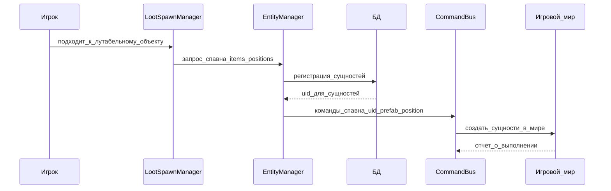
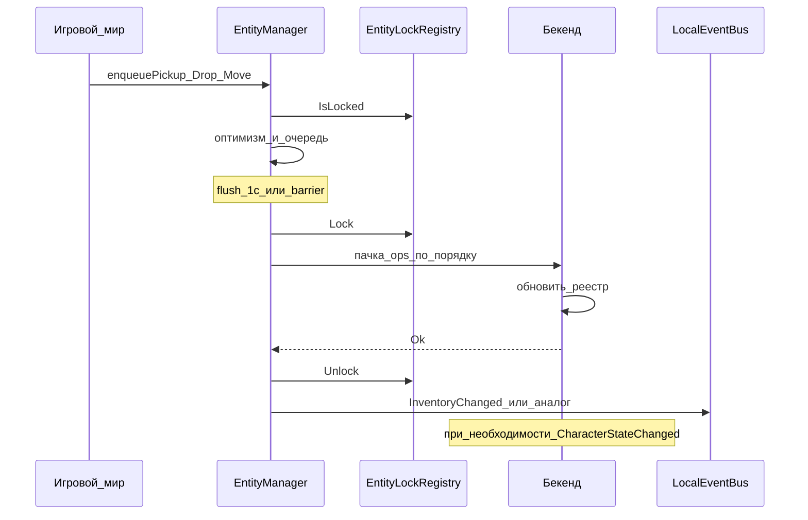

# EntityManager

Назад: [[Architecture.md]]

EntityManager хранит состояние всех сущностей в игре: техники, оружия, боеприпасов, одежды, экипировки, предметов инвентаря и других объектов, которые могут существовать в мире или быть привязаны к игроку.

## Зависимости

```text
EntityManager ──depends on──► EntityLockRegistry
```

[[EntityLockRegistry.md|EntityLockRegistry]] — **отдельный сервис** (описан в своём документе). EntityManager не хранит реестр блокировок внутри себя: `Lock` ставится **когда пачка ops по uid уходит на бекенд (in-flight)**, после ответа — `Unlock`. Пока ops только в очереди — lock нет. Политика очереди / flush / barrier: [[EntityManager.Operations.md]].

Тем же сервисом пользуется TradeManager (`SellPending`), поэтому in-flight дропа и продажа видят одну картину занятости uid.

## Назначение

EntityManager является реестром игровых сущностей и связывает состояние бекенда с состоянием игрового мира.

Он отвечает за:

- регистрацию новых сущностей в БД;
- выдачу и сохранение `uid` сущности;
- хранение текущего положения сущности: в мире, у игрока или внутри контейнера / в слоте;
- **синхронизацию с бекендом** изменений владения и расположения (подбор, дроп, move, экипировка, передача);
- вызов [[EntityLockRegistry.md|EntityLockRegistry]] на время in-flight пачки (блок / разблок uid);
- обновление связей при изменении инвентаря;
- регистрацию удаления сущности;
- постановку команд в CommandBus, когда изменение должно быть применено в игровом мире (путь бекенд → мир).

Бекенд остается источником истины по состоянию сущностей. Игровой сервер применяет решения бекенда в мире отдельным шагом через CommandBus. Подробнее: [[BackendGameMutation.md]].

### Предметы — сущности мира

Элементы инвентаря и экипировки — **сущности в игровом мире**. К инвентарю персонажа они привязаны только связями:

- владелец (персонаж) — при необходимости;
- контейнер (`containerUid`);
- слот (экипировка / позиция в контейнере);
- либо координаты в мире (если предмет лежит на земле).

Предмет **не перестаёт** быть сущностью мира, когда попадает в рюкзак или слот оружия. Поэтому синхронизация предметов с бекендом — **ответственность EntityManager**, а не [[CharacterStateManager (черновик) 3.md|CharacterStateManager]].

В снимке CharacterState инвентарь — лишь **проекция** связей из этого реестра (для UI / recovery). CSM не принимает и не шлёт item/equip operations.

---

## Спавн лута

Спавн лута начинается на стороне игрового сервера. Когда игрок подходит к зданию или другому лутабельному объекту, внутриигровой `LootSpawnManager` определяет, какие предметы должны появиться и в каких позициях.

`LootSpawnManager` отправляет в EntityManager запрос со списком элементов и координатами `x`, `y`, `z`. EntityManager регистрирует эти элементы в БД, назначает каждому элементу `uid` и отправляет в игровую командную шину команды на спавн.

После этого CommandBus доставляет команды игровому серверу. Игровой сервер создает предметы в указанных позициях и присваивает им полученные `uid`.



---

## Синхронизация расположения (игра → бекенд)

Если игрок берёт предмет, выбрасывает его, передаёт другому игроку, перемещает между контейнерами или надевает / снимает экипировку, **игровые системы инвентаря / мира вызывают EntityManager** (не CharacterStateManager и не `applyOperations` персонажа).

EntityManager отправляет изменение на бекенд и обновляет в реестре связи сущности:

- предмет находится у конкретного игрока;
- предмет лежит в конкретном контейнере / слоте;
- предмет находится в мире на определенной позиции;
- предмет больше не принадлежит игроку или контейнеру.

Так EntityManager сохраняет актуальную картину владения и расположения предметов. Остальные менеджеры опираются на этот реестр при торговле, удалении, восстановлении состояния или сборке проекции CharacterState.



**Граница с CSM:**

| Действие | Кто |
|----------|-----|
| Подбор / дроп / move / equip / unequip / transfer / split-merge / destroy сущности | EntityManager |
| HP, жажда, голод, поза/координаты персонажа, cash вне Trade | CharacterStateManager |
| Buy / Sell | TradeManager → бекенд → CommandBus в мир |

Если commit связей у персонажа на бекенде увеличивает `stateVersion` CharacterState, публикуется `CharacterStateChanged`. CSM только мягко сверяет версию; мир предметов уже согласован через EntityManager / CommandBus.

Подробный жизненный цикл операций и очередь: [[EntityManager.Operations.md]].

---

## Блокировки через EntityLockRegistry

Полное описание сервиса: [[EntityLockRegistry.md]].

**Правило:** блокировка uid для ops EntityManager — **только через EntityLockRegistry**, и **только на время in-flight** (не на всё время очереди).

| Момент | Вызов EntityLockRegistry |
|--------|--------------------------|
| `enqueue*` | `IsLocked`? если да (in-flight / SellPending) — отказ; иначе оптимизм + очередь **без** Lock |
| flush пачки (~1 с / barrier) | `Lock(…, ownerService: EntityManager)` → отправка |
| Ok / Fail с бекендом | `Unlock` |
| Уже есть `SellPending` от Trade | отказ enqueue (не выбрасывать продаваемый предмет) |
| CommandBus `removeEntity` | удалить сущность **даже при lock** → `Unlock` → очистить очередь ops по uid |
| Hard-reset дюпов | выровнять мир → `Unlock` → очистить очередь |

```text
enqueuePickupEntity / enqueueDropEntity / enqueueMoveEntity
  → EntityLockRegistry.IsLocked (отказ если занято)
  → локальный оптимизм + очередь EntityManager
  → flush (таймер / barrier) → Lock → пачка на бекенд
  → Ok/Fail → Unlock
```

Очередь, barrier (магазин и др.), порядок пачки: [[EntityManager.Operations.md]].

---

## Контейнеры и вложенность

Сущность может быть обычным предметом или контейнером. Контейнеры могут быть вложены в другие контейнеры, а сама сущность-контейнер также остается обычной сущностью с собственным `uid`.

Пример вложенности:

```text
Игрок
└── Рюкзак
    ├── Обувь
    ├── Пистолет
    └── Банка тушенки
```

В этой модели рюкзак принадлежит игроку, а обувь, пистолет и банка тушенки находятся внутри рюкзака. Если рюкзак передан другому игроку или выброшен в мир, EntityManager обновляет связь для рюкзака и сохраняет вложенную структуру его содержимого.

---

## Каталог операций расположения (игра → бекенд)

Контракт бекенда (имена ориентировочные). На игровом сервере им соответствуют методы EntityManager; вызывающий код (инвентарь / мир) **не** ходит в CSM.

| Операция (бек) | Смысл |
|----------------|--------|
| `PickUpEntity` | из мира → контейнер / слот персонажа |
| `DropEntity` | из инвентаря / слота → мир |
| `MoveEntity` | между слотами / контейнерами |
| `EquipItem` / `UnequipItem` | надеть / снять |
| `SwapEquipment` | обмен слотов |
| `TransferEntity` | передача другому персонажу |
| `SplitStack` / `MergeStack` | стеки (если есть в проекте) |
| `DestroyEntity` | уничтожение / снятие с реестра (контракт уточняется отдельно) |

Публичная точка входа на игровом сервере — методы `enqueue*` (см. ниже): локальный оптимизм + очередь; `Lock` — при flush пачки. Вызывающий код (инвентарь / мир) **не** ходит в CSM и не собирает HTTP-пачки сам.

---

## Методы

### enqueueDropEntity

**Сигнатура:**

```text
enqueueDropEntity(string entityUid, vector position, string characterUid): void
```

**Параметры:**

- `entityUid` — идентификатор сущности, которую выбрасывают в мир;
- `position` — координаты дропа в мире;
- `characterUid` — персонаж, инициировавший дроп.

**Описание:**

1. Проверяет, что сущность существует и действие допустимо; через EntityLockRegistry: при `IsLocked(entityUid)` (in-flight EM или `SellPending` от Trade) — отказ.
2. Локально применяет оптимизм: сущность переносится на землю (не клон), обновляются связи в реестре сущностей EntityManager.
3. Добавляет в исходящую очередь операцию `DropEntity` с текущим `resetGeneration` сущности (без Lock).
4. Отправка — на flush (~1 с или barrier): тогда `Lock(entityUid, reason: Drop, …)` и пачка на бекенд. См. [[EntityManager.Operations.md]].

После Ok — `Unlock`. После Fail — откат локального расположения и `Unlock`.

---

### enqueuePickupEntity

**Сигнатура:**

```text
enqueuePickupEntity(string entityUid, string targetContainerUid, string characterUid, string slot?): void
```

**Параметры:**

- `entityUid` — идентификатор подбираемой сущности;
- `targetContainerUid` — контейнер / слот назначения (инвентарь персонажа, рюкзак и т.п.);
- `characterUid` — персонаж, который подбирает;
- `slot` — слот назначения, если нужен контракту.

**Описание:**

1. Проверяет доступность сущности; если `EntityLockRegistry.IsLocked(entityUid)` (in-flight / SellPending) — отказ. Если чужой `Drop` ещё только в очереди — подбор допустим и встаёт в очередь того же uid после `Drop`.
2. Локально переносит сущность в целевой контейнер (один экземпляр на uid).
3. Ставит в очередь операцию `PickUpEntity` с `resetGeneration` (без Lock).
4. На flush: `Lock(entityUid, reason: PickUp, …)`; при политике родителя — узкий `ContainerDispose` на контейнере назначения; пачка на бекенд с сохранением порядка.

Ok → `Unlock`. Fail → откат в предыдущее расположение (например обратно на землю / в машину) и `Unlock`.

---

### enqueueMoveEntity

**Сигнатура:**

```text
enqueueMoveEntity(string entityUid, string targetContainerUid, string characterUid, string slot?): void
```

**Параметры:**

- `entityUid` — перемещаемая сущность;
- `targetContainerUid` — контейнер назначения;
- `characterUid` — персонаж, инициировавший перемещение;
- `slot` — слот назначения, если нужен.

**Описание:**

1. Проверяет EntityLockRegistry (`IsLocked` → отказ) и доменные правила (вместимость, владение контейнером и т.п.).
2. Локально обновляет связи контейнер/слот.
3. Ставит в очередь `MoveEntity` с `resetGeneration` (без Lock).
4. На flush: `Lock(entityUid, reason: Move, …)`; если цель — рюкзак / носимый контейнер — дополнительно `ContainerDispose` по политике вложенности (рюкзак — да; машину для езды — нет); пачка на бекенд.

Ok → снять все lock’и этой операции. Fail → откат связей и Unlock.

---

## Дюпы и hard-reset

При нескольких экземплярах одного `entityUid` в мире бекенд инициирует анализатор: hard-reset к истине бекенда и отсечение устаревших операций через `resetGeneration` на сущность.

Подробно: [[EntityManager.DupeAnalyzer.md]].

---

## Анти-паттерны

1. Синхронизировать подбор / дроп / экипировку через CharacterStateManager / `applyOperations` персонажа.
2. Считать инвентарь отдельным списком «вне» реестра сущностей (без `entityUid` и связей контейнер/слот).
3. Менять владение в мире после Trade в обход CommandBus и EntityManager.
4. Делать union / merge двух текущих списков инвентаря при рассинхроне (см. [[CharacterStateManager (черновик) 3.md]]).
5. Дублировать lock внутри EntityManager вместо [[EntityLockRegistry.md|EntityLockRegistry]].
6. Игнорировать `SellPending` от Trade и выбрасывать продаваемый предмет.
7. Глобально стопорить все операции мира из‑за одной сущности.
8. Блокировать вождение машины из‑за in-flight предмета в её инвентаре.
9. Отказать CommandBus `removeEntity` из‑за локального lock.

---

## Связанные документы

- [[Architecture.md]] — оглавление архитектуры менеджеров
- [[BackendGameMutation.md]] — принцип применения изменений мира через CommandBus
- [[EntityLockRegistry.md]] — общий реестр блокировок (EntityManager + Trade)
- [[EntityManager.Operations.md]] — логика операций и очередь
- [[EntityManager.DupeAnalyzer.md]] — анализатор дюпов, hard-reset, игнор операций
- [[TradeManager.md]] — sell и Lock на время продажи
- [[CharacterStateManager (черновик) 3.md]] — состояние персонажа; инвентарь только как проекция
- [[../CommandBus/CommandBus.md]] — доставка команд с бекенда
- [[../CommandBus/Commands.md]] — список команд игрового сервера
