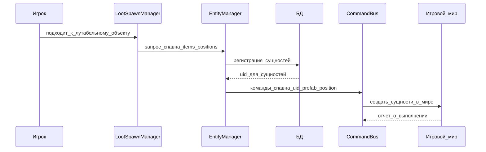

# EntityManager

Назад: [[Architecture.md]]

EntityManager хранит состояние всех сущностей в игре: техники, оружия, боеприпасов, одежды, экипировки, предметов инвентаря и других объектов, которые могут существовать в мире или быть привязаны к игроку.

## Назначение

EntityManager является реестром игровых сущностей и связывает состояние бекенда с состоянием игрового мира.

Он отвечает за:

- регистрацию новых сущностей в БД;
- выдачу и сохранение `uid` сущности;
- хранение текущего положения сущности: в мире, у игрока или внутри контейнера;
- обновление связей при изменении инвентаря;
- регистрацию удаления сущности;
- постановку команд в CommandBus, когда изменение должно быть применено в игровом мире.

Бекенд остается источником истины по состоянию сущностей. Игровой сервер применяет это состояние отдельным шагом через CommandBus. Подробнее: [[BackendGameMutation.md]].

## Спавн лута

Спавн лута начинается на стороне игрового сервера. Когда игрок подходит к зданию или другому лутабельному объекту, внутриигровой `LootSpawnManager` определяет, какие предметы должны появиться и в каких позициях.

`LootSpawnManager` отправляет в EntityManager запрос со списком элементов и координатами `x`, `y`, `z`. EntityManager регистрирует эти элементы в БД, назначает каждому элементу `uid` и отправляет в игровую командную шину команды на спавн.

После этого CommandBus доставляет команды игровому серверу. Игровой сервер создает предметы в указанных позициях и присваивает им полученные `uid`.



## Изменение инвентаря

Если игрок берет предмет, выбрасывает его, передает другому игроку или перемещает между контейнерами, игровой сервер отправляет в EntityManager событие об изменении инвентаря.

EntityManager должен обновить в БД связи сущностей:

- предмет находится у конкретного игрока;
- предмет лежит в конкретном контейнере;
- предмет находится в мире на определенной позиции;
- предмет больше не принадлежит игроку или контейнеру.

Так EntityManager сохраняет актуальную картину владения и расположения предметов, а остальные менеджеры могут опираться на этот реестр при торговле, удалении, восстановлении состояния или других операциях.

## Контейнеры и вложенность

Сущность может быть обычным предметом или контейнером. Контейнеры могут быть вложены в другие контейнеры, а сама сущность-контейнер также остается обычной сущностью с собственным `uid`.

Пример вложенности:

```text
Игрок
└── Рюкзак
    ├── Обувь
    ├── Пистолет
    └── Банка тушенки
```

В этой модели рюкзак принадлежит игроку, а обувь, пистолет и банка тушенки находятся внутри рюкзака. Если рюкзак передан другому игроку или выброшен в мир, EntityManager обновляет связь для рюкзака и сохраняет вложенную структуру его содержимого.

## Методы

### registerEntityBuy

**Сигнатура:**

```text
registerEntityBuy(Entity entity, string shopUid, string accountUid): string
```

**Параметры:**

- `entity` — объект сущности;
- `shopUid` — идентификатор магазина;
- `accountUid` — идентификатор аккаунта, который осуществил покупку.

**Описание:**

Метод отправляет запрос на бекенд и в ответ получает `uid` сущности. Полученный `uid` записывается в свойство сущности. После регистрации бекенд может поставить команду в CommandBus, чтобы предмет или техника появились в игровом мире.

### registerRemoveEntity

**Сигнатура:**

```text
registerRemoveEntity(Entity entity, ReasonEnum reason): void
```

**Параметры:**

- `entity` — объект сущности;
- `reason` — одна из причин удаления сущности: продажа, уничтожение или другая доменная причина.

**Описание:**

Метод регистрирует удаление объекта. Игровой сервер отправляет на бекенд `uid` сущности и причину удаления, а бекенд фиксирует удаление сущности в реестре.

## Связанные документы

- [[Architecture.md]] — оглавление архитектуры менеджеров
- [[BackendGameMutation.md]] — принцип применения изменений мира через CommandBus
- [[../CommandBus/CommandBus.md]] — доставка команд с бекенда
- [[../CommandBus/Commands.md]] — список команд игрового сервера